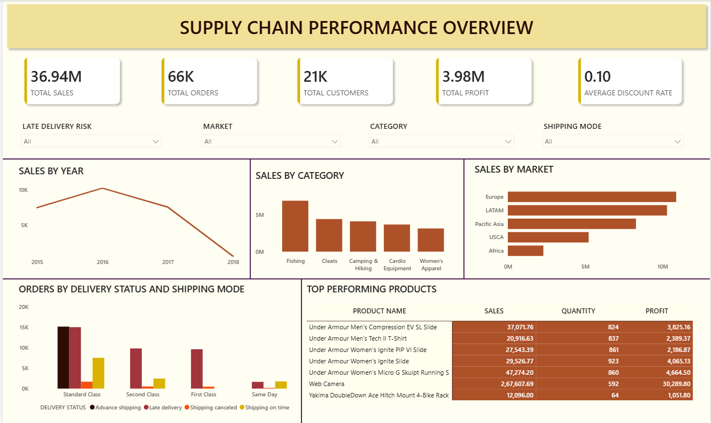

# Supply Chain Sales & Delivery Performance Dashboard

An end-to-end data analytics project built on the DataCo Supply Chain dataset — covering data modeling, ETL, and dashboarding to analyze sales performance, profitability, and delivery operations across regions and shipping modes.



---

## Table of Contents

- [Project Overview](#project-overview)
- [Business Problem](#business-problem)
- [Tech Stack](#tech-stack)
- [Architecture](#architecture)
- [Data Model](#data-model)
- [Key Measures](#key-measures)
- [Dashboard](#dashboard)
- [Key Insights](#key-insights)
- [Repository Structure](#repository-structure)
- [How to Reproduce](#how-to-reproduce)
- [Learnings & Next Steps](#learnings--next-steps)
- [Contact](#contact)

---

## Project Overview

This project transforms a flat, denormalized supply chain dataset (DataCo) into a clean star-schema data model and an interactive Power BI dashboard. It covers the full pipeline from raw data ingestion through a medallion architecture (Bronze → Silver → Gold) in MySQL, to a fully modeled semantic layer in Power BI, to a single-page executive dashboard.

The goal was to practice the complete analyst workflow — not just building charts, but making deliberate modeling decisions (grain, surrogate keys, role-playing dimensions) and translating a messy operational dataset into something decision-makers could actually use.

## Business Problem

A global supply chain company needs visibility into three things at once:

1. **Sales & profitability** — where is revenue and margin coming from (category, market, product)?
2. **Delivery performance** — how often are shipments late, and does that vary by shipping mode?
3. **Customer & geographic distribution** — where are orders concentrated, and who are the top customers/products?

The raw data arrives as a single wide table mixing customer, product, order, and shipping details — not analysis-ready. This project restructures it into a proper model and surfaces the above in one dashboard.

## Tech Stack

| Layer | Tool |
|---|---|
| Data storage & transformation | MySQL |
| Data modeling | Star schema (Kimball-style dimensional modeling) |
| Visualization | Power BI |
| Language | SQL, DAX |

## Architecture

Data flows through a medallion architecture before reaching the semantic model:

```
DataCo source CSV
        ↓
Bronze layer (MySQL)      → raw load, no transformations
        ↓
Silver layer (MySQL)      → cleaned, deduplicated, type-cast;
                             customer address split from order/shipping geography
        ↓
Gold layer (MySQL views)  → star schema: fact + dimension tables,
                             surrogate keys generated
        ↓
Power BI semantic model   → relationships, role-playing date dimension
                             (order date vs. ship date via USERELATIONSHIP)
        ↓
Power BI dashboard
```

## Data Model

The Gold layer is modeled as a star schema with one fact table and eight dimensions:

**Fact table**
- `fact_order_items` — grain: one row per order line item. Contains all numeric measures (sales, discount, profit, quantity, shipping days, late delivery risk) plus foreign keys to every dimension.

**Dimension tables**
- `dim_customers` — customer identity and home address
- `dim_product` — product attributes, linked to `dim_category`
- `dim_category` — product category lookup
- `dim_department` — department lookup
- `dim_geography` — order-level shipping destination (city, state, country, region, market, lat/long) — kept separate from customer address, since a customer's home location and an order's shipping destination aren't always the same
- `dim_shipping` — shipping mode and delivery status
- `dim_payment_type` — payment method (debit, transfer, cash, payment)
- `dim_date` — single calendar table used twice via role-playing relationships (order date, ship date)

Order Status is kept as a degenerate dimension directly on the fact table rather than normalized out, since it carries no additional describable attributes.

## Key Measures

Built in DAX on top of the fact table, grouped by theme:

**Sales & Revenue:** Total Sales, Order Item Total, Sales per Customer, Avg Product Price, Total Discount, Avg Discount Rate

**Profitability:** Total Profit, Avg Profit Ratio, Profit Margin %

**Volume:** Total Quantity Sold, Total Orders, Total Order Items, Total Customers, Avg Items per Order

**Shipping & Delivery:** Avg Scheduled/Real Shipping Days, Shipping Delay, Late Delivery Count, Late Delivery Rate %

**Time Intelligence:** Sales YTD, Sales PY, Sales Growth %, Sales by Ship Date (via `USERELATIONSHIP`)

## Dashboard

A single-page dashboard designed to cover sales, profitability, operations, and customer/geographic distribution without becoming cluttered:

- **KPI row** — Total Sales, Total Orders, Total Customers, Total Profit, Average Discount Rate
- **Global filters** — Late Delivery Risk, Market, Category, Shipping Mode
- **Sales by Year** — revenue trend over time
- **Sales by Category** — where revenue concentrates
- **Sales by Market** — geographic distribution
- **Orders by Delivery Status and Shipping Mode** — operational performance, stacked by delivery outcome
- **Top Performing Products** — ranked table by sales, quantity, and profit

## Key Insights

- Sales peaked in 2016 and declined through 2018, warranting further investigation into whether this reflects a genuine business trend or a data coverage gap.
- **Fishing** and **Cleats** are the top-performing categories by sales, with a clear drop-off after the top three categories.
- **Europe** and **LATAM** are the leading markets by sales, while **Africa** lags well behind all other regions.
- **Standard Class** shipping carries by far the highest order volume and the highest concentration of late deliveries, suggesting operational bottlenecks concentrated in the default shipping tier.
- A handful of products (e.g. Under Armour lines) dominate the top-performer list by both sales and profit, indicating potential concentration risk in the product mix.

## Repository Structure

```
├── sql/
│   ├── bronze/           # raw ingestion scripts
│   ├── silver/           # cleaning & transformation scripts
│   └── gold/             # star schema view definitions
├── powerbi/
│   └── supply_chain_dashboard.pbix
├── assets/
│   ├── dashboard_overview.png
│   └── er_diagram.png
├── docs/
│   └── data_dictionary.md
└── README.md
```

## How to Reproduce

1. Clone this repository.
2. Load the DataCo source CSV into a MySQL instance (Bronze layer scripts in `sql/bronze/`).
3. Run the Silver layer scripts to clean and split fields.
4. Run the Gold layer view scripts to generate the star schema.
5. Open `powerbi/supply_chain_dashboard.pbix` and point the data source to your MySQL instance.
6. Refresh the model — relationships and measures are pre-built.

## Learnings & Next Steps

This project reinforced the importance of getting the data model right before building any visuals — early attempts at dashboards without proper fact/dimension design led to inaccurate aggregations (e.g. counting distinct dimension rows instead of fact rows). Rebuilding with a proper star schema fixed this and made the DAX measures far more reliable.

**Possible extensions:**
- Add a forecasting page (sales/profit trend projection)
- Build out a dedicated Customer Segment analysis page
- Automate the Bronze → Silver → Gold pipeline with a scheduling tool

